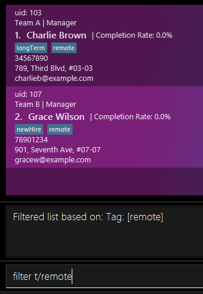

# ContactSwift User Guide

Welcome to ContactSwift, the desktop app designed for efficient employee contact and task management. Optimized for use via a [Command Line Interface (CLI)](#cli-command-line-interface) while also providing a [Graphical User Interface (GUI)](#gui-graphical-user-interface), ContactSwift is ideal for small business owners, managers, and team leaders who aim to streamline their remote team’s workflows.

This guide will equip you with everything you need to maximize the benefits of ContactSwift, from initial setup to advanced features.

**Key Features:**

- Rapid contact management through intuitive CLI commands.
- Comprehensive task tracking and productivity analysis.
- Advanced filtering and searching capabilities for employee information (even if employees may have some same fields).

**Unique ID System:**
Each contact in ContactSwift is assigned a unique identifier (UID), ensuring precise and efficient management of contact details. This UID is key to performing actions like editing, deleting, or adding tasks for specific contacts. You will encounter these UIDs as you use various commands, offering a streamlined way to manage large datasets. This system is designed to enhance the user experience, enabling you to easily deal with duplicates!
<box type="warning">
Data modifications may cause unexpected errors. It is recommended to back up the data file before making any changes. Please refer to the Saving the Data section for more information.
</box>

**Who is this for?**
This guide is tailored for small business owners and remote team managers seeking an effective solution to manage contact details and tasks. We assume users have a basic understanding of command-line operations but have structured this guide to be accessible even to those new to CLI environments.

**Purpose of this Guide:**
To help you quickly become proficient with ContactSwift, enabling you to manage your team’s contacts and tasks more effectively and efficiently.

## How to Use This Guide

Navigate through this guide using the [Table of Contents](#table-of-contents). Icons and formatting are used throughout to signify different types of information:

- **Bold** for commands and important terms.
- _Italics_ for notes and additional information.
- `Code` for actual input commands and any technical references to code, filenames, terminology, etc.

Check the [Glossary](#glossary) for explanations of technical terms to ensure a smooth learning experience with ContactSwift.

---

## Table of Contents

1. [Quick Start](#quick-start)
2. [Features](#features)
3. [Managing Your Employees](#managing-your-employees)
4. [FAQ](#faq)
5. [Known Issues](#known-issues)
6. [Command Summary](#command-summary)
7. [Feedback and Support](#feedback-and-support)
   - [How to Provide Feedback](#how-to-provide-feedback)
   - [Feedback Etiquette](#feedback-etiquette)
   - [What Happens to Your Feedback](#what-happens-to-your-feedback)
8. [Glossary](#glossary)

---

## Quick Start

Embark on your ContactSwift journey with these straightforward steps:

1. **Installation**: Ensure Java `11` or above is installed on your computer. [Learn how to check your Java version](https://www.java.com/en/download/help/version_manual.html).
2. **Download**: Access the latest `contactswift.jar` from our [releases page](https://github.com/AY2324S2-CS2103T-T17-2/tp/releases/tag/v1.3).
3. **Setup**: Select a folder as your home for ContactSwift and move the downloaded file there.
4. **Launch**: Open a command terminal, navigate to your home folder, and initiate the application with `java -jar contactswift.jar`. The GUI, populated with sample data, will appear as shown below:

  
_Figure 1: The main interface of ContactSwift, showcasing sample data._

5. **Get Commanding**: Input commands in the command box and press Enter. Try these to get started:
   - `list` – Displays all contacts.
   - `add n/John Doe p/98765432 e/johnd@example.com a/John street, block 123, #01-01 T/A r/Manager` – Adds a new contact.
   - `delete uid/101` – Removes the contact with the 'uid' of 101.
   - `edit 2 n/James Lee` – Updates the name of the second contact.
   - `find John` – Searches for contacts with the name `John`.
   - `filter r/Manager` – Filters contacts by role.
   - `addTask uid/1 Complete the report by 5pm` – Adds a task to the contact with the `uid` of 1.
   - `clear` – Deletes all contacts.
   - `exit` – Closes the application.

For a detailed explanation of all commands, refer to the [Features](#features) section.

[Back to table of contents](#table-of-contents)

---

## Features

<box type="info" seamless>

**Understanding the command format is crucial for using ContactSwift effectively. Here are some tips:** 

- Words in `UPPER_CASE` are the parameters to be supplied by the user. 
  e.g. in `add n/NAME`, `NAME` is a parameter which can be used as `add n/John Doe`.

- Items in square brackets are optional. 
  e.g. `n/NAME [t/TAG]` can be used as `n/John Doe t/friend` or as `n/John Doe`.

- Items with `…`​ after them can be used multiple times including zero times. 
  e.g. `[t/TAG]…​` can be used as ` ` (i.e. 0 times), `t/friend`, `t/friend t/family` etc.

- Parameters can be in any order. 
  e.g. if the command specifies `n/NAME p/PHONE_NUMBER`, `p/PHONE_NUMBER n/NAME` is also acceptable.

- Extraneous parameters for commands that do not take in parameters (such as `help`, `list`, `exit` and `clear`) will be ignored. 
  e.g. if the command specifies `help 123`, it will be interpreted as `help`.

- If you are using a PDF version of this document, be careful when copying and pasting commands that span multiple lines as space characters surrounding line-breaks may be omitted when copied over to the application.
  </box>

[Back to table of contents](#table-of-contents)

### Viewing help : `help`

Shows a message explaining how to access the help page.

 
_Figure: The help command output in ContactSwift._

Format: `help`

### Listing all employees : `list`

Shows a list of all employees in the address book.

Format: `list`

### Adding an employee: `add`

Adds an employee to the address book.

Format: `add n/NAME p/PHONE_NUMBER e/EMAIL a/ADDRESS r/ROLE T/TEAM [t/TAG]…​`

<box type="tip" seamless>

**Tip:** An employee can have any number of tags (including 0)
</box>

Examples:

- `add n/John Doe p/98765432 e/johnd@example.com a/John street, block 123, #01-01 T/A r/Manager`
- `add n/Betsy Crowe t/friend e/betsycrowe@example.com a/Newgate Appartment p/1234567 T/B r/Secretary`

<box type="warning">

**Caution:** Ensure the `PHONE_NUMBER` is valid; ContactSwift does not accept phone numbers with less than 3 digits.
</box>

[Back to table of contents](#table-of-contents)

### Locating employees by name: `find`

Finds employees whose names contain any of the given keywords.

Format: `find KEYWORD [MORE_KEYWORDS]`

- The order of the keywords does not matter. e.g. `Hans Bo` will match `Bo Hans`
- Only the name is searched.
- Persons matching at least one keyword will be returned (i.e. `OR` search).
  e.g. `Hans Bo` will return `Hans Gruber`, `Bo Yang`

Examples:

- `find John` returns `john` and `John Doe`
- `find alice david` returns `Alice Smith`, `David Williams` 
  

### Important Note Before Using Task-Related Commands

Before using any task-related commands (`addTask`, `mark`, `unmark`, `deleteTask`), you must first find the employee using the `find` command. This ensures that the employee's information is correctly loaded and visible in the [UI (User Interface)](#ui-user-interface), and any subsequent commands will reflect their effects immediately in the UI.

Example of using the `find` command:

- `find John Doe` will search and display the tasks and details of 'John Doe' in the UI.

**Caution:** Due to a current bug, if you do not use the `find` command to locate and display the employee's details before executing other commands, the changes may not immediately reflect in the UI.

### Add task to an employee's task list: `addTask`

Adds a task to an employee's task list.

**Reminder:** Use the `find` command to ensure the employee's details are displayed in the UI before adding a task.

Format: `addTask uid/UID DESCRIPTION`

- Adds a task to the employee with the specified `UID`.
- The `UID` refers to the user ID displayed beside the employee's name.
- The description of the task must be provided.
- The description of the task can only contain alphanumeric characters and spaces, and cannot be empty.

Examples:

- `addTask uid/1 Complete the report by 5pm`
- `addTask uid/2 Submit the proposal by 10am`

[Back to table of contents](#table-of-contents)

### Mark a task as completed: `mark`

Marks a task as completed in the employee's task list.

**Reminder:** Use the `find` command to ensure the employee's details are displayed in the UI before marking a task as completed.

Format: `mark uid/UID TASKINDEX`

- Marks the task at the specified `TASKINDEX` as completed for the employee with the specified `uid`.
- The `UID` refers to the user ID displayed beside the employee's name.
- The `TASKINDEX` refers to the index number shown in the displayed task list.
- The `TASKINDEX` **must be a positive integer** 1, 2, 3, …​ and must exist as displayed in the UI.

**Caution:** This command can mark a task that is already marked as completed. Use this feature carefully to avoid misrepresenting the completion status of tasks.

Examples:

- `mark uid/1 2` marks the 2nd task in the task list of the employee with the `UID` of 1 as completed.
- `mark uid/2 1` marks the 1st task in the task list of the employee with the `UID` of 2 as completed.

[Back to table of contents](#table-of-contents)

### Unmark a task as completed: `unmark`

Unmarks a task as completed in the employee's task list.

**Reminder:** Use the `find` command to ensure the employee's details are displayed in the UI before unmarking a task.

Format: `unmark uid/UID TASKINDEX`

- Unmarks the task at the specified `TASKINDEX` as not completed for the employee with the specified `uid`.
- The `UID` refers to the user ID displayed beside the employee's name.
- The `TASKINDEX` refers to the index number shown in the displayed task list.
- The `TASKINDEX` **must be a positive integer** 1, 2, 3, …​ and must exist as displayed in the UI.

**Caution:** This command can unmark a task that is not marked as completed. Be cautious to ensure accurate tracking of task completion status.

Examples:

- `unmark uid/1 2` unmarks the 2nd task in the task list of the employee with the `UID` of 1 as not completed.
- `unmark uid/2 1` unmarks the 1st task in the task list of the employee with the `UID` of 2 as not completed.

[Back to table of contents](#table-of-contents)

### Delete a task from an employee's task list: `deleteTask`

Deletes a task from an employee's task list.

**Reminder:** Use the `find` command followed by the `list` command to ensure the employee's details and tasks are displayed in the UI before deleting a task.

Format: `deleteTask uid/UID TASKINDEX`

- Deletes the task at the specified `TASKINDEX` from the task list of the employee with the specified `uid`.
- The `UID` refers to the user ID displayed beside the employee's name.
- The `TASKINDEX` refers to the index number shown in the displayed task list.
- The `TASKINDEX` **must be a positive integer** 1, 2, 3, …​ and must exist as displayed in the UI.

Examples:

- `deleteTask uid/1 2` deletes the 2nd task in the task list of the employee with the `UID` of 1.
- `deleteTask uid/2 1` deletes the 1st task in the task list of the employee with the `UID` of 2.

[Back to table of contents](#table-of-contents)

### Filter employees by name, tags, roles, or teams: `filter`

The `filter` command is used to search for employees based on specific attributes such as their name, tags, roles, or teams. This powerful tool allows you to narrow down the list of employees to those who meet certain criteria, making it easier to manage and interact with your employees.

Format: `filter [n/NAME] [t/TAG] [r/ROLE] [T/TEAM]`

**Important:** While each parameter (`NAME`, `TAG`, `ROLE`, `TEAM`) is individually optional and enclosed in brackets `[ ]` indicating optional input, **you must provide at least one of these parameters** for the command to function.

**Note:** If no parameters are provided, the command will fail to execute, showing the message: "No valid fields present for filter command".

This command filters the list of employees based on their name, tags, roles, or teams.

- Filters the employee list according to the specified criteria.
- Employees matching all provided criteria will be listed (i.e., `AND` search).
- Only single values are allowed for the name, role, and team parameters. Tags can accept multiple values, each preceded by `t/`.
- When filtering by team, prepend "Team " to the team name (e.g., `T/Team HR`) to ensure accurate filtering.
- Name and team fields are case-insensitive, meaning they do not require an exact match of case to filter correctly. For instance, `T/Team HR` is equivalent to `T/team hr`.
- Role and tag fields are case-sensitive, meaning they require an exact match of case to filter correctly. For instance, `r/Manager` will not match `r/manager`.
- Name must be an exact match, however it is case-insensitive. For instance, `n/jane` will not match `Jane Doe`. It must be the full name `n/jane doe`.
- The order of the parameters does not matter. e.g. `filter n/John Doe t/friend` will produce the same output as `filter t/friend n/John Doe`.

Examples:

- `filter t/friend t/Colleague` : Shows all employees tagged as `friend` and `Colleague`, respecting case for tags.
- `filter n/jane doe` : Shows employees named `Jane Doe`, regardless of the case used in the filter.
- `filter r/Executive T/TEAM SALES` : Shows employees with the role `Executive` (exact case match required) and in the 'Sales' team, regardless of how the team name's case is entered.
- `filter t/remote` should produce a similar output as below: 
  

[Back to table of contents](#table-of-contents)

### Editing an employee : `edit`

Edits an existing employee in the address book.

Format: `edit INDEX [n/NAME] [p/PHONE] [e/EMAIL] [a/ADDRESS] [T/TEAM] [r/ROLE] [t/TAG]…​`

- Edits the employee at the specified `INDEX`. The index refers to the index number shown in the displayed employee list. The index **must be a positive integer** 1, 2, 3, …​
- At least one of the optional fields must be provided.
- Existing values will be updated to the input values.
- When editing tags, the existing tags of the employee will be removed i.e. adding of tags is not cumulative.
- You can remove all the employee’s tags by typing `t/` without specifying any tags after it.

Examples:

- `edit 1 p/91234567 e/johndoe@example.com` Edits the phone number and email address of the 1st employee to be `91234567` and `johndoe@example.com` respectively.
- `edit 2 n/Betsy Crower t/` Edits the name of the 2nd employee to be `Betsy Crower` and clears all existing tags.

[Back to table of contents](#table-of-contents)

### Deleting an employee : `delete`

Deletes the specified employee from the address book.

Format: `delete INDEX` or `delete uid/UID` or `delete NAME`

- Deletes the employee at the specified `INDEX`/`UID`/`NAME`.
- The `NAME` should not include numbers.
- The index refers to the index number shown in the displayed employee list.
- The index **must be a positive integer** 1, 2, 3, …​ and must be within the range of the displayed list.
- The UID refers to the user ID displayed beside the employee's name.
- The name must be an exact match, however it is case-insensitive.

**Caution:** Deleting an employee is irreversible. Ensure you have selected the correct `INDEX`, `UID`, or `NAME` before proceeding.

Examples:

- `list` followed by `delete 2` deletes the 2nd employee in the address book.
- `delete betsy` deletes the employee with the name `betsy` if there are no duplicates. In the case of duplicates, the user will be prompted to delete by uid.
- `delete uid/101` deletes the employee with the `uid` of 101.

[Back to table of contents](#table-of-contents)

### Clearing all entries : `clear`

Clears all entries from the address book.

Format: `clear`

### Exiting the program : `exit`

Exits the program.

Format: `exit`

[Back to table of contents](#table-of-contents)

### Saving the Data

ContactSwift data are saved in the hard disk automatically after any command that changes the data. There is no need to save manually.

**Note:** While ContactSwift attempts to save automatically, it's good practice to regularly back up your data file, especially before making bulk changes or updates.

<box type="warning">

**Caution:** If your changes to the data file make its format invalid, ContactSwift will discard all data and start with an empty data file or template data at the next run. We recommend taking a backup of the file before editing it. Furthermore, certain edits can cause ContactSwift to behave in unexpected ways (e.g., if a value entered is outside the acceptable range). Edit the data file only if you are confident that you can update it correctly.
</box>

[Back to table of contents](#table-of-contents)

---

# Managing your employees

Great! You have successfully installed ContactSwift and are ready to manage your employees. Let's use all the awesome features that ContactSwift has to offer.

## Track your team's productivity!

We are thrilled to introduce a sophisticated enhancement to our application - the **Completion Rate Statistics**. This innovative feature is designed to provide a comprehensive overview of task management efficiency within your teams, offering a deeper insight into employee productivity.

##### Understanding the Essence of Completion Rate Statistics

Within the dynamic interface of ContactSwift, each employee now boasts a visible completion rate on their profile card. This rate, a calculated metric representing the proportion of completed tasks to total tasks assigned, serves as an indicator of individual productivity levels. Automatically updated as tasks evolve, this metric ensures that you have the most current view of your team's performance.

**How to use it?** This feature requires no manual intervention to activate. The completion rate metric operates seamlessly, reflecting real-time updates as tasks are added, completed, or removed. This automatic integration ensures that productivity insights are consistently accurate and available without additional effort from you or your team.

We believe that the Completion Rate Statistics feature will significantly contribute to enhancing the efficiency and productivity of your team, offering a clear, quantifiable measure of task management success. We are confident that this addition will empower you and your team to achieve and surpass your productivity goals.

[Back to table of contents](#table-of-contents)

### Archiving data files `[coming in v2.0]`

_Details coming soon ..._

---

## FAQ

**Q1: How do I install Java 11?**  
**A1:** Follow the instructions on the [Java 11 download page](https://www.oracle.com/java/technologies/javase-jdk11-downloads.html).

**Q2: How can I transfer my ContactSwift data to another computer?**  
**A2:** Install ContactSwift on the other computer and overwrite the empty data file it creates with the file that contains the data of your previous ContactSwift home folder.

**Q3: How do I change the data file that ContactSwift uses?**  
**A3:** ContactSwift uses the file `data/addressbook.json` in the home folder by default. You can modify the data inside that file or replace it with another file of the same name.

**Q4: If I modify the data how do I know it won't run into errors?**  
**A4:** ContactSwift can run into unexpected errors if the data file is modified incorrectly. It is recommended to back up the data file before making any changes. However, the command line will log an error message if the data file is corrupted and provide feedback on what went wrong. Depending on the error, the software may start with an empty data file or a template file.

**Q5: What happens if I run commands with corrupted data ?**  
**A5:** ContactSwift will overwrite the corrupted data file with a new one and start with an empty address book.

**Q6: How can I print the contact details or task list?**  
**A6:** Currently, ContactSwift does not support direct printing. However, you can the JSON file to some other format (like CSV) and print it.

**Q7: What are the limits on the number of contacts or tasks I can add?**  
**A7:** ContactSwift does not have a hard limit on the number of contacts or tasks you can add. However, the performance may degrade with a large number of contacts or tasks. For all practical purposes however the application should be able to handle a few thousand contacts and tasks.

**Q9: Can I customize the fields for each contact or task in ContactSwift?**  
**A9:** ContactSwift does not support custom fields for contacts or tasks. However, you can use the tags field to add additional information.

**Q10: How do I report a bug or issue with ContactSwift?**  
**A10:** Please refer to the [Feedback and Support](#feedback) section for information on how to report bugs or issues.

**Q11: How do I request a new feature for ContactSwift?**  
**A11:** Please refer to the [Feedback and Support](#feedback) section for information on how to request new features.

[Back to table of contents](#table-of-contents)

---

## Known issues

1. **When using multiple screens**, if you move the application to a secondary screen, and later switch to using only the primary screen, the GUI will open off-screen. The remedy is to delete the `preferences.json` file created by the application before running the application again.

[Back to table of contents](#table-of-contents)

---

## Command summary

| Action          | Format, Examples                                                                                                                                                                                  |
| --------------- | ------------------------------------------------------------------------------------------------------------------------------------------------------------------------------------------------- |
| **Add**         | `add n/NAME p/PHONE_NUMBER e/EMAIL a/ADDRESS T/TEAM r/ROLE [t/TAG]…​`   e.g., `add n/James Ho p/22224444 e/jamesho@example.com a/123, Clementi Rd, 1234665 T/A r/Cleaner t/friend t/colleague` |
| **Add Task**    | `addTask uid/UID DESCRIPTION`   e.g., `addTask uid/1 Complete the report by 5pm`, `addTask uid/2 Submit the proposal by 10am`                                                                  |
| **Clear**       | `clear`                                                                                                                                                                                           |
| **Delete**      | `delete INDEX`/`delete uid/UID`/`delete NAME`  e.g., `delete 3`, `delete uid/101`, `delete John Doe`                                                                                           |
| **Delete Task** | `deleteTask uid/UID TASKINDEX`   e.g., `deleteTask uid/1 3`                                                                                                                                    |
| **Edit**        | `edit INDEX [n/NAME] [p/PHONE_NUMBER] [e/EMAIL] [a/ADDRESS] [T/TEAM] [r/ROLE] [t/TAG]…​`  e.g.,`edit 2 n/James Lee e/jameslee@example.com`                                                     |
| **Exit**        | `exit`                                                                                                                                                                                            |
| **Filter**      | `filter [n/NAME] [t/TAG] [r/ROLE] [T/TEAM]`   e.g., `filter t/friend`,`filter r/Manager T/Team HR`, `filter T/Team HR t/friend r/Executive`                                                    |
| **Find**        | `find KEYWORD [MORE_KEYWORDS]`  e.g., `find James Jake`                                                                                                                                        |
| **List**        | `list`                                                                                                                                                                                            |
| **Help**        | `help`                                                                                                                                                                                            |
| **Mark Task**   | `mark uid/UID TASKINDEX`   e.g., `mark uid/1 3`                                                                                                                                                |
| **Unmark Task** | `unmark uid/UID TASKINDEX`   e.g., `unmark uid/1 2`                                                                                                                                            |

[Back to table of contents](#table-of-contents)

---

## Feedback and Support

Feedback is a crucial component of continuous improvement for ContactSwift. We actively encourage users, developers, and stakeholders to provide feedback to help us enhance both the functionality of ContactSwift and the usefulness of this Developer Guide.

Here are the ways you can contribute feedback and suggestions:

### How to Provide Feedback

#### Issue Tracker

For technical issues, bugs, or feature requests, please use our [official Issue Tracker](https://github.com/AY2324S2-CS2103T-T17-2/tp/issues). This allows us to categorize and prioritize issues effectively. When submitting an issue, please include as much detail as possible, such as the steps to reproduce the issue, expected versus actual behavior, and environment details (OS, ContactSwift version, etc.).

#### Email

If you have suggestions for improving the Developer Guide or need to discuss matters that require discretion, we'll be providing our email soon here. We appreciate detailed feedback that includes specific sections or topics and any recommendations for improvement.

#### Surveys and Feedback Forms

Periodically, we may circulate surveys or feedback forms to gather comprehensive opinions on specific aspects of ContactSwift or the Developer Guide. These are excellent opportunities to influence the future direction of the software and documentation.

### Feedback Etiquette

Constructiveness: We highly value constructive feedback that provides actionable insights and suggestions for improvement.

Respect and Courtesy: Engage respectfully and professionally with community members and maintain a supportive environment.

Confidentiality: Avoid sharing sensitive or confidential information in public forums or issue trackers.

### What Happens to Your Feedback

1. Review Process: All feedback is reviewed by the development team. We prioritize actions based on the impact, feasibility, and alignment with our development roadmap.

2. Implementation: If your feedback leads to a change or improvement, we will acknowledge contributions in upcoming release notes or directly within the revised sections of the guide.

3. Response: While we aim to respond to all feedback, the volume of input may affect our ability to reply individually. However, we value every piece of feedback and strive to incorporate it as best as we can.

Your insights and contributions are invaluable to us and help ensure that ContactSwift continues to evolve in ways that meet and exceed user needs and expectations. Thank you for helping us improve and for being an active member of our community.

[Back to table of contents](#table-of-contents)

## Glossary

### CLI (Command Line Interface)

A type of user interface that allows users to interact with a computer program or operating system by typing commands into a console or terminal. CLI is known for its efficiency in performing tasks, enabling users to execute complex commands through concise textual input.

### GUI (Graphical User Interface)

A user interface that allows users to interact with electronic devices through graphical icons and visual indicators, as opposed to text-based interfaces, typed command labels, or text navigation. GUIs are typically considered user-friendly, especially for navigating complex software or managing multiple tasks simultaneously, as they provide a visual representation of the system’s operations.

### UI (User Interface)

The space where interactions between humans and the system occur. This includes any part of the system, like screens or pages, where users can view or interact with tasks, contacts, or other information. It is designed to be intuitive and user-friendly to facilitate efficient task management and navigation.

### Unique Identifier (UID)

UID is a unique identifier assigned to each contact in ContactSwift, enabling precise and efficient management of contact details. Such identifiers serve to differentiate contacts and facilitate actions like editing, deleting, or adding tasks for specific contacts. UIDs are essential for managing large datasets and ensuring accurate contact management.

### Alphanumeric characters

Any combination of the alphabets A-Z and numbers 0-9.

[Back to table of contents](#table-of-contents)

---
