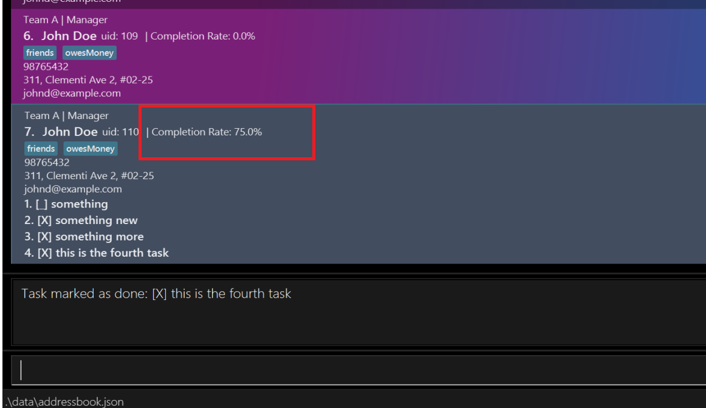

# ContactSwift User Guide

ContactSwift is a **desktop app for managing emplyoee contacts, optimized for use via a Command Line Interface** (CLI) while still having the benefits of a Graphical User Interface (GUI). If you can type fast, ContactSwift can get your contact management tasks done faster than traditional GUI apps.

This APP allows small business owners to manage their employees intuitively using simple commands and a compact list of their information. A key advantage of using this APP is the feature that allows users to track their employees tasks and completion rate, adding on the ability to filter your employee list using specific parameters!

Start using our APP **TODAY** by following our quick start guide below.

<!-- * Table of Contents -->
<page-nav-print />

---

## Quick start

1. Ensure you have Java `11` or above installed in your Computer.

2. Download the latest `contactswift.jar` from [here](https://github.com/AY2324S2-CS2103T-T17-2/tp/releases/tag/MVP).

3. Copy the file to the folder you want to use as the _home folder_ for your AddressBook.

4. Open a command terminal, `cd` into the folder you put the jar file in, and use the `java -jar addressbook.jar` command to run the application. 
   A GUI similar to the below should appear in a few seconds. Note how the app contains some sample data. 
   

5. Type the command in the command box and press Enter to execute it. e.g. typing **`help`** and pressing Enter will open the help window. 
   Some example commands you can try:

   - `list` : Lists all contacts.

   - `add n/John Doe p/98765432 e/johnd@example.com a/John street, block 123, #01-01 T/A r/Manager` : Adds a contact named `John Doe` to the Address Book.

   - `delete 3` : Deletes the 3rd contact shown in the current list.

   - `clear` : Deletes all contacts.

   - `exit` : Exits the app.

6. Refer to the [Features](#features) below for details of each command.

---

## Features

<box type="info" seamless>

**Notes about the command format:** 

- Words in `UPPER_CASE` are the parameters to be supplied by the user. 
  e.g. in `add n/NAME`, `NAME` is a parameter which can be used as `add n/John Doe`.

- Items in square brackets are optional. 
  e.g `n/NAME [t/TAG]` can be used as `n/John Doe t/friend` or as `n/John Doe`.

- Items with `…`​ after them can be used multiple times including zero times. 
  e.g. `[t/TAG]…​` can be used as ` ` (i.e. 0 times), `t/friend`, `t/friend t/family` etc.

- Parameters can be in any order. 
  e.g. if the command specifies `n/NAME p/PHONE_NUMBER`, `p/PHONE_NUMBER n/NAME` is also acceptable.

- Extraneous parameters for commands that do not take in parameters (such as `help`, `list`, `exit` and `clear`) will be ignored. 
  e.g. if the command specifies `help 123`, it will be interpreted as `help`.

- If you are using a PDF version of this document, be careful when copying and pasting commands that span multiple lines as space characters surrounding line-breaks may be omitted when copied over to the application.
  </box>

### Viewing help : `help`

Shows a message explaning how to access the help page.

Format: `help`

### Adding an employee: `add`

Adds a employee to the address book.

Format: `add n/NAME p/PHONE_NUMBER e/EMAIL a/ADDRESS T/TAG r/ROLE [t/TAG]…​`

<box type="tip" seamless>

**Tip:** An employee can have any number of tags (including 0)
</box>

Examples:

- `add n/John Doe p/98765432 e/johnd@example.com a/John street, block 123, #01-01 T/A r/Manager`
- `add n/Betsy Crowe t/friend e/betsycrowe@example.com a/Newgate Appartment p/1234567 T/B r/Secretary`

### Add task to an employee's task list: `addtask`

Adds a task to an employee's task list.

Format: `addTask uid/<uid> <description>`

- Adds a task to the employee with the specified `uid`.
- The `uid` refers to the user ID displayed beside the employee's name.
- The description of the task must be provided.
- The description of the task can only contain alphanumeric characters and spaces and cannot be empty.

Examples:

- `addTask uid/1 Complete the report by 5pm`
- `addTask uid/2 Submit the proposal by 10am`

### Mark a task as completed: `mark`

Marks a task as completed in the employee's task list.

Format: `mark uid/<uid> <taskIndex>`

- Marks the task at the specified `taskIndex` as completed for the employee with the specified `uid`.
- The `uid` refers to the user ID displayed beside the employee's name.
- The `taskIndex` refers to the index number shown in the displayed task list.
- The `taskIndex` **must be a positive integer** 1, 2, 3, …​

Examples:

- `mark uid/1 2` marks the 2nd task in the task list of the employee with the `uid` of 1 as completed.
- `mark uid/2 1` marks the 1st task in the task list of the employee with the `uid` of 2 as completed.

### Unmark a task as completed: `unmark`

Unmarks a task as completed in the employee's task list.

Format: `unmark uid/<uid> <taskIndex>`

- Unmarks the task at the specified `taskIndex` as not completed for the employee with the specified `uid`.
- The `uid` refers to the user ID displayed beside the employee's name.
- The `taskIndex` refers to the index number shown in the displayed task list.
- The `taskIndex` **must be a positive integer** 1, 2, 3, …​

Examples:

- `unmark uid/1 2` unmarks the 2nd task in the task list of the employee with the `uid` of 1 as not completed.
- `unmark uid/2 1` unmarks the 1st task in the task list of the employee with the `uid` of 2 as not completed.

### Delete a Task from an employee's task list: `deletetask`

Deletes a task from an employee's task list.

Format: `deleteTask uid/<uid> <taskIndex>`

- Deletes the task at the specified `taskIndex` from the task list of the employee with the specified `uid`.

Examples:

1. `deleteTask uid/103 1` will delete the 1st task from the task list of the employee with the `uid` of 103.
2. `deleteTask uid/148 2` will delete the 2nd task from the task list of the employee with the `uid` of 148.

### Filter employees by name, tags, roles, or teams: `filter`

Filters the list of employees based on their name, tags, roles, or teams.

Format: `filter [n/NAME] [t/TAG] [r/ROLE] [T/TEAM]`

- Filters the employee list according to the specified criteria.
- At least one of the parameters must be provided.
- Employees matching all provided criteria will be listed (i.e., `AND` search).
- Multiple values for each parameter can be provided, separated by a space.

Examples:

- `filter n/John Doe` : Shows all employees with the name `John Doe`.
- `filter t/friend` : Shows all employees tagged as `friend`.
- `filter r/Manager T/HR` : Shows all employees who are managers and belong to the HR team.
- `filter t/friend t/colleague r/Technician` : Shows all employees tagged as `friend` and `colleague` who are also technicians.
- `filter n/Jane Doe t/friend r/Executive` : Shows employees named `Jane Doe`, tagged as `friend`, and with the role of `Executive`.

### Listing all employees : `list`

Shows a list of all employees in the address book.

Format: `list`

### Editing a employee : `edit`

Edits an existing employee in the address book.

Format: `edit INDEX [n/NAME] [p/PHONE] [e/EMAIL] [a/ADDRESS] [T/TEAM] [r/ROLE] [t/TAG]…​`

- Edits the employee at the specified `INDEX`. The index refers to the index number shown in the displayed employee list. The index **must be a positive integer** 1, 2, 3, …​
- At least one of the optional fields must be provided.
- Existing values will be updated to the input values.
- When editing tags, the existing tags of the employee will be removed i.e adding of tags is not cumulative.
- You can remove all the employee’s tags by typing `t/` without
  specifying any tags after it.

Examples:

- `edit 1 p/91234567 e/johndoe@example.com` Edits the phone number and email address of the 1st employee to be `91234567` and `johndoe@example.com` respectively.
- `edit 2 n/Betsy Crower t/` Edits the name of the 2nd employee to be `Betsy Crower` and clears all existing tags.

### Locating employees by name: `find`

Finds employees whose names contain any of the given keywords.

Format: `find KEYWORD [MORE_KEYWORDS]`

- The order of the keywords does not matter. e.g. `Hans Bo` will match `Bo Hans`
- Only the name is searched.
- Persons matching at least one keyword will be returned (i.e. `OR` search).
  e.g. `Hans Bo` will return `Hans Gruber`, `Bo Yang`

Examples:

- `find John` returns `john` and `John Doe`
- `find alice david` returns `Alice Smith`, `David Williams` 
  

### Deleting a employee : `delete`

Deletes the specified employee from the address book.

Format: `delete INDEX`/`delete UID`/`delete NAME`

- Deletes the employee at the specified `INDEX`/`UID`/`NAME`.
- The index refers to the index number shown in the displayed employee list.
- The index **must be a positive integer** 1, 2, 3, …​
- The UID refers to the user ID displayed beside the employee's name.

Examples:

- `list` followed by `delete 2` deletes the 2nd employee in the address book.
- `delete betsy` deletes the the employee with the name `betsy` if there are no duplicates. In the case of duplicates, a list will be provided to prompt for specifics.

### Clearing all entries : `clear`

Clears all entries from the address book.

Format: `clear`

### Exiting the program : `exit`

Exits the program.

Format: `exit`

### Saving the data

AddressBook data are saved in the hard disk automatically after any command that changes the data. There is no need to save manually.

### Editing the data file

AddressBook data are saved automatically as a JSON file `[JAR file location]/data/addressbook.json`. Advanced users are welcome to update data directly by editing that data file.

<box type="warning" seamless>

**Caution:**
If your changes to the data file makes its format invalid, AddressBook will discard all data and start with an empty data file at the next run. Hence, it is recommended to take a backup of the file before editing it. 
Furthermore, certain edits can cause the AddressBook to behave in unexpected ways (e.g., if a value entered is outside the acceptable range). Therefore, edit the data file only if you are confident that you can update it correctly.
</box>

# Managing your employees

Great! You have successfully installed ContactSwift and are ready to manage your employees. Let's use all the awesome features that ContactSwift has to offer.

## Track your team's productivity!

We are thrilled to introduce a sophisticated enhancement to our application - the **Completion Rate Statistics**. This innovative feature is designed to provide a comprehensive overview of task management efficiency within your teams, offering a deeper insight into employee productivity.

##### Understanding the Essence of Completion Rate Statistics

Within the dynamic interface of ContactSwift, each employee now boasts a visible completion rate on their profile card. This rate, a calculated metric representing the proportion of completed tasks to total tasks assigned, serves as an indicator of individual productivity levels. Automatically updated as tasks evolve, this metric ensures that you have the most current view of your team's performance.

**How to use it?** This feature requires no manual intervention to activate. The completion rate metric operates seamlessly, reflecting real-time updates as tasks are added, completed, or removed. This automatic integration ensures that productivity insights are consistently accurate and available without additional effort from you or your team.

We believe that the Completion Rate Statistics feature will significantly contribute to enhancing the efficiency and productivity of your team, offering a clear, quantifiable measure of task management success. We are confident that this addition will empower you and your team to achieve and surpass your productivity goals.

### Archiving data files `[coming in v2.0]`

_Details coming soon ..._

---

## FAQ

**Q**: How do I transfer my data to another Computer? 
**A**: Install the app in the other computer and overwrite the empty data file it creates with the file that contains the data of your previous AddressBook home folder.

---

## Known issues

1. **When using multiple screens**, if you move the application to a secondary screen, and later switch to using only the primary screen, the GUI will open off-screen. The remedy is to delete the `preferences.json` file created by the application before running the application again.

---

## Command summary

| Action     | Format, Examples                                                                                                                                                                                  |
| ---------- | ------------------------------------------------------------------------------------------------------------------------------------------------------------------------------------------------- |
| **Add**    | `add n/NAME p/PHONE_NUMBER e/EMAIL a/ADDRESS T/TEAM r/ROLE [t/TAG]…​`   e.g., `add n/James Ho p/22224444 e/jamesho@example.com a/123, Clementi Rd, 1234665 T/A r/Cleaner t/friend t/colleague` |
| **Clear**  | `clear`                                                                                                                                                                                           |
| **Delete** | `delete INDEX`/`delete UID`/`delete NAME`  e.g., `delete 3`, `delete 101`, `delete John`                                                                                                       |
| **Edit**   | `edit INDEX [n/NAME] [p/PHONE_NUMBER] [e/EMAIL] [a/ADDRESS] [T/TEAM] [r/ROLE] [t/TAG]…​`  e.g.,`edit 2 n/James Lee e/jameslee@example.com`                                                     |
| **Find**   | `find KEYWORD [MORE_KEYWORDS]`  e.g., `find James Jake`                                                                                                                                        |
| **List**   | `list`                                                                                                                                                                                            |
| **Help**   | `help`                                                                                                                                                                                            |
